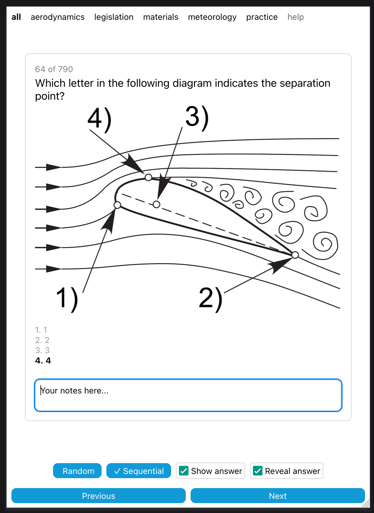

# SHV-FSVL-Theory-Practice-Questions

Helping you study for the SHV paragliding theory exam. 

https://austingayler.github.io/SHV-FSVL-Theory-Practice-Questions/

Project is built with Expo/React Native, so to start:

`yarn` to install dependencies
then 
`yarn start`

Otherwise the usual commands apply, peek in package.json for everything.

